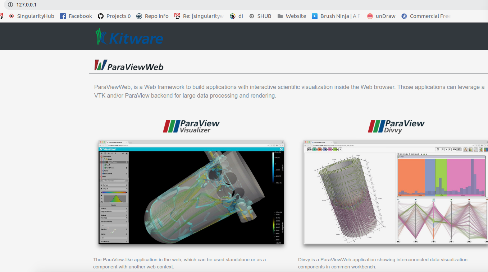

# Paraview

## Docker
It was hard to get it working with Singularity (this is common, it's read only!) so let's start
with a Docker container. We can use the container provided from [this Dockerfile](https://github.com/Kitware/paraviewweb/blob/master/tools/docker/demo/Dockerfile). Run the container, and note we are binding a port for the web socket as well.

You can do the below on a Mac with Nvidia runtime:

```bash
docker run -p 0.0.0.0:9000:80 --runtime=nvidia -ti kitware/paraviewweb:pvw-egl-demo-v5.6.0 "ws://localhost:9000/"
```

ON a computer without (like mine)

```bash
docker run -p 0.0.0.0:9000:80 -ti kitware/paraviewweb:pvw-osmesa-demo-v5.6.0 "ws://localhost:9000/" "-dr" "--mesa-swr"
```

## Singularity
Now that the above is working in Docker, we can try to get it working with Singularity. Since
I don't have nvidia or gpu I'll be using the second container, `kitware/paraviewweb:pvw-osmesa-demo-v5.6.0`.
First, build the image:

```bash
$ sudo singularity build paraview-web.simg Singularity
```

Make a folder to bind to on the host, along with other files that need write:

```bash
$ mkdir -p /tmp/apache2/run
$ mkdir -p /tmp/apache2/logs
$ mkdir -p /tmp/wslink/logs
$ touch /tmp/wslink/proxy-mapping.txt
```

Start the container instance, here we are naming it "paraview." Since we need writable
to /var/lock we must be sudo.

```bash
$ sudo singularity instance.start --bind /tmp/apache2/run:/var/run/apache2 --bind /tmp/apache2/logs:/var/log/apache2 --bind /tmp/wslink/logs:/opt/wslink-launcher/logs --bind /tmp/wslink/proxy-mapping.txt:/opt/wslink-launcher/proxy-mapping.txt paraview-web.simg paraview
```

You should now see the paraview interface running on [127.0.0.1](http://127.0.0.1)



Note that you *must* stop local web servers, including any Docker applications
running on that port. I'm not privy to how paraview works, but given this setup
you should be able to figure it out from here. Here is how to shell into the
container:


## Interactive shell
I had needed to debug further to see how to get paraview working. Here is how to shell inside.


```bash
$ sudo singularity shell instance://paraview
```

## Cleaning Up

And to stop the container, you also need sudo

```bash
$ sudo singularity instance.stop instance://paraview
```

I'm not sure if this is reasonable to run in user space because of needing write
to /var/lock. Using sudo with singularity seems to defeat the purpose. If you
figure out a good approach please send a pull request to this repository!
Remember that to use nvidia, you would need to change the `From` line in
the Singularity file to `kitware/paraviewweb:pvw-egl-demo-v5.6.0` and then add
`--nv` to take advantage of the libraries on the host.

Also note that if you are using Singularity 3.0 and up the instance group is now changed 
to "instance stop" and "instance start"
